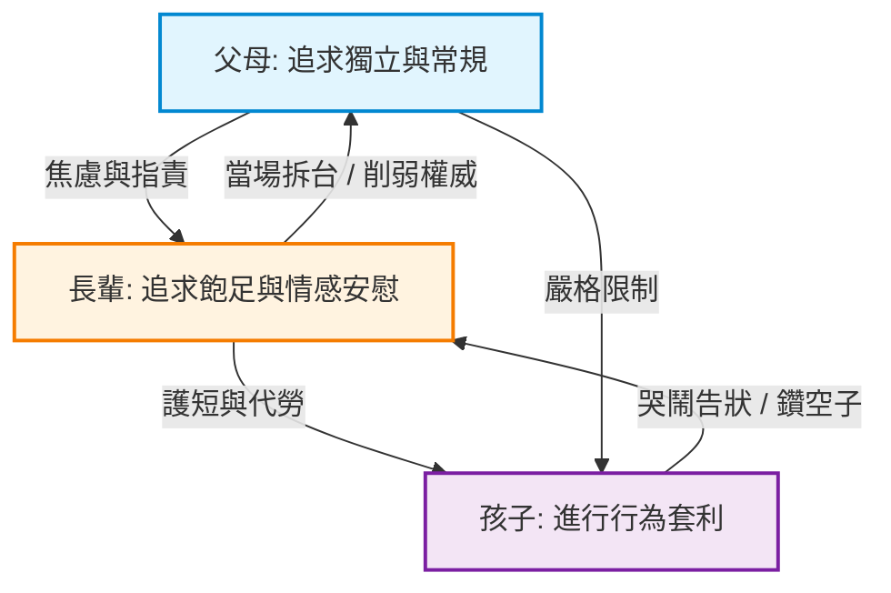
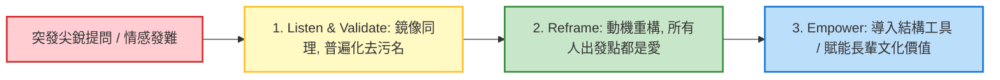

# Presentation Brief:《三代共贏的教養智慧》

> **課程名稱**：三代共贏的教養智慧：化解隔代衝突，營造溫暖堅定的家庭同盟  
> **課程時長**：90 分鐘（完整教學模組）  
> **適用受眾**：澳門幼兒至小學階段雙職父母、同住或協助托育之祖父母（同場參與）  
> **教學架構**：王永福（福哥）ASK 模型 × 臨床家庭系統理論（Bowen & Minuchin）  
> **設計定位**：高情感安全感、超低認知負荷、極致實戰落地、杜絕學術說教與代際公審

---

## 1. 受眾心理畫像與澳門在地場域特徵 (Target Persona & Context)

### 👥 受眾組成與心理痛點
1. **澳門年輕雙職父母（28–42 歲）**：
   - **生態特徵**：高比例任職於博彩、酒店、醫護、警務或跨班輪班行業，下班時大腦前額葉皮質疲憊見底。
   - **核心痛點**：下班回家看見長輩追餵飯、塞手機、過度代勞，焦慮孩子養成壞習慣；想立規矩又怕被長輩說「嫌棄老人」、內疚於無法全職陪伴。
2. **同住/協力祖父母（55–75 歲）**：
   - **生態特徵**：全日買餸、煮飯、接放學、盯生活，體力透支。
   - **核心痛點**：付出極多卻常被子女的臉色或一句「唔好咁教」刺傷；極度擔心被指責觀念落後，內心渴望付出被看見與尊重。
3. **第三代幼童（3–10 歲）**：
   - **行為特徵**：天生精準捕捉大人之間的規則縫隙，在父母與長輩之間進行「行為套利」，看人下菜碟，導致自我控制力與抗挫力受損。

### 🛡️ 場域最高防護鐵律
- **嚴禁「批判長輩大會」**：前 15 分鐘必須確立長輩「首席家庭合夥人」地位，嚴防年輕父母藉由專家言論「指責長輩」。
- **管教責任徹底回歸父母**：長輩不承擔常規成敗的道德包袱，釋放長輩心理壓力。

---

## 2. 系統性矛盾與臨床病灶 (Systemic Dynamics)



1. **病態三角化（Bowen Triangulation）**：父母立規矩時，孩子向長輩哭訴求助，長輩當場介入推翻決定，形成「同盟對抗」，削弱父母執行次系統。
2. **邊界混淆（Boundary Diffusion）**：管教責任與寵愛邊界重疊，家庭缺乏明確分工矩陣。
3. **神經生物學疲勞塌陷**：輪班雙職父母在極度疲憊下無法執行繁複溝通，退行至發脾氣或徹底放任。

---

## 3. 王永福 ASK 教學目標模型 (ASK Learning Hierarchy)

| 維度 | 學習層次 | 具體教學成果目標 | 檢驗標準 |
| :--- | :--- | :--- | :--- |
| **Attitude（態度/心態）** | **做到 (Do & Transform)** | 1. **長輩**：卸下防禦與愧疚，感受到至高尊重，自願在規則前台給父母補台。<br>2. **父母**：放下怨懟與挑剔，承擔 100% 管教責任，深切感恩長輩付出。<br>3. **全家**：現場形成「三代教養合夥人」心態，杜絕當場拆台。 | 現場長輩點頭認同，三代家庭現場完成情境對練承諾。 |
| **Skill（技能/工具）** | **得到 (Acquire & Practice)** | 1. **2×2 教養分工矩陣**：區分「3 條父母絕對底線」與「長輩彈性寵愛空間」。<br>2. **5 秒交接棒句式**：下班進門秒用「看見辛苦＋接過責任＋請長輩休息」。<br>3. **長輩 3 秒轉移腳本**：「阿嬤惜你，媽媽規矩要守，做完西瓜等你」。<br>4. **第三方中立權威盾牌**：藉助醫生、牙醫、學校醫囑化解婆媳面子之爭。<br>5. **家庭幽默通關暗號**：「超人休息」，化解即時衝突。 | 現場 100% 學員在 PESOS 演練中完成情境角色扮演對話。 |
| **Knowledge（知識/認知）** | **知道 (Understand)** | 1. 理解長輩代勞與寵愛背後的演化情感價值（安全依戀資產）。<br>2. 洞悉兒童「行為套利」對大腦前額葉自控力發育的長遠危害。<br>3. 掌握 Bowen 家庭系統「自我分化」與「前台一致性」的重要性。 | 能在案例討論中一眼指認行為套利機制。 |

---

## 4. 90 分鐘節奏架構與分段設計 (90-Minute Agenda Architecture)

```
00m ─── 15m ────── 40m ────────── 65m ────────── 80m ──── 90m
 │  Hook   │   Point (揭示本質)  │   Skill (實戰工具)  │ Action(角色扮演)│ Q&A
 │ 致敬長輩 │   拆解套利與三角化   │   2x2矩陣/5秒話術   │ 現場情境對練  │ 拆彈昇華
```

### ⏱️ 第一階段：開場破冰與高位致敬（00:00 - 15:00，共 15 分鐘）
- **核心任務**：拆除長輩防禦，確立「家庭定海神針」地位，封死年輕父母藉刀殺人通道。
- **教學手法**：王永福「大字流金句」+「情境提問互動」。
- **關鍵行為**：引導現場所有父母起立/轉身向長輩鞠躬致謝：「辛苦晒您，多謝您！」。

### ⏱️ 第二階段：衝突真相與系統揭秘（15:00 - 40:00，共 25 分鐘）
- **核心任務**：透過幽默生動的情境劇還原三大火花（追餵飯、搶手機、代勞穿鞋），揭示孩子「行為套利」本質。
- **教學手法**：個案還原法（Case Replay）+ 現場即時舉手投票。
- **核心認知**：長輩護短看似愛孫，實則損害孩子長遠抗挫力；定調「前台永不拆台」鐵律。

### ⏱️ 第三階段：2×2 分工矩陣與實戰工具（40:00 - 65:00，共 25 分鐘）
- **核心任務**：提供極低認知負荷的實戰溝通工具。
- **教學手法**：PESOS 示範演練（E: 我說給你聽，S: 我做給你看）。
- **工具清單**：
  - **工具 1：2×2 分工矩陣**（父母管安全/睡眠/尊重 3 條底線；其餘 90% 歸長輩自由寵愛）。
  - **工具 2：5 秒下班交接句**（「媽辛苦晒，等我返嚟接手，你快去休息！」）。
  - **工具 3：長輩 3 秒轉移句**（溫柔支持＋維護規則＋積極代償）。
  - **工具 4：第三方權威盾牌**（醫生醫囑單作客觀依據）。

### ⏱️ 第四階段：現場實作：三代家庭情境實戰角色扮演（65:00 - 80:00，共 15 分鐘）
- **核心任務**：將課堂所學透過現場情境對練（Roleplay）內化為肌肉記憶。
- **教學手法**：PESOS 練習（O: 讓你做做看）+ 講師巡迴教練與三明治回饋（S: 督導回饋）。
- **產出成果**：每組家庭現場完成高頻情境角色扮演（3C/飲食/睡前），並確立 1 個家庭幽默暗號。

### ⏱️ 第五階段：現場 Q&A 拆彈與情感昇華（80:00 - 90:00，共 10 分鐘）
- **核心任務**：化解現場婆媳/代際高難度提問，昇華「雙倍的愛是孩子最大的福氣」。
- **教學手法**：Listen-Validate-Reframe 拆彈模型 + 大字流結語收尾。

---

## 5. 實戰話術與工具庫 (Scripts & Toolsets)

### 📌 模組 A：5 秒下班接棒句（父母專用）
> **情境**：下班進門看見孩子一邊看電視一邊讓阿婆餵飯。  
> **話術**：  
> **「媽，辛苦晒你今日帶咗阿寶一日！等我返嚟接手，你快啲坐低飲啖水、睇電視歇息下，呢度交畀我搞！」**  
> *(心理效果：肯定勞苦＋物理隔離戰場＋責任主動回歸)*

### 📌 模組 B：3 秒溫柔轉移句（長輩專用）
> **情境**：孩子被媽媽罰不能看 iPad，跑來抱著阿公阿嬤大哭告狀。  
> **話術**：  
> **「阿嬤好惜你，不過啱先媽媽講咗要先做完功課。你快啲做完，阿嬤切定甜甜的西瓜等你！」**  
> *(心理效果：給予情感依戀＋守住父母權威＋封死套利空間)*

### 📌 模組 C：第三方盾牌話術（婆媳/代際協商專用）
> **情境**：長輩頻繁給孩子吃糖果甜飲導致蛀牙。  
> **話術**：  
> **「媽，今日牙醫特別叮囑，話阿寶呢隻牙再發炎就要去醫院做手術受大罪，交代呢兩個月全家嚴格控糖，我哋一齊幫阿寶度過呢關！」**  
> *(心理效果：剝離對錯評判，將衝突轉化為全家對抗客觀健康威脅)*

---

## 6. 極端情境公關與防禦化解指引 (Safety Rails & Crisis Triage)



1. **媳婦現場哭訴婆婆頑固**：
   - 先接納情緒（「感謝你的真實，在座有多少人有過類似糾結？」）。
   - 重構動機（媽媽要健康，婆婆想逗孫開心，雙方都是愛）。
   - 給出工具（醫生醫囑單盾牌，不打面子之爭）。
2. **強勢阿公搶麥批專家理論不實際**：
   - 全場起立為阿公撫育多名子女的成就熱烈鼓掌。
   - 區分時代情境（以前需吃苦堅韌，現代面對演算法與 3C 誘惑）。
   - 賦能阿公為「家族故事傳承導師」，讓作業常規回歸父母。

---

## 7. 成果檢驗標準 (Evaluation Criteria)

- ✅ **安全感指標**：長輩全程無防禦抗拒神色，中途退場率 0%。
- ✅ **實作完成度**：現場 95% 以上家庭完成現場情境對練並約定家庭通關暗號。
- ✅ **課後滿意度**：父母與長輩雙向評分達 9.0/10 以上，無「偏袒任何一方」之負評。
